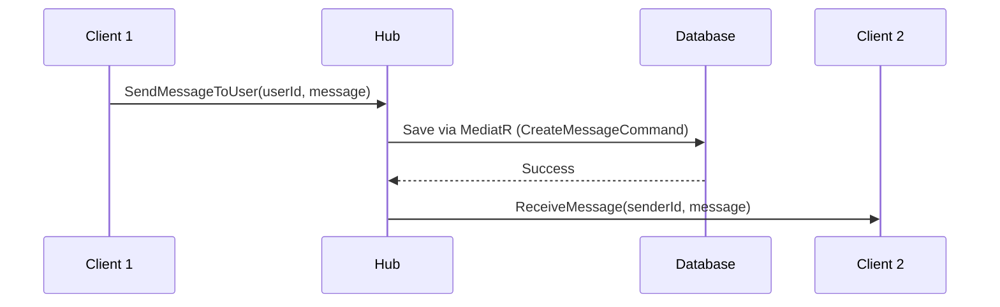
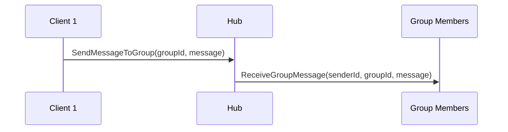

# ChatHub Server Integration Guide

## Server Hub Implementation

The backend ChatHub is implemented in C# using ASP.NET Core SignalR with the following features:

### Hub Class: `ChatHub`

**Dependencies:**
- `IGroupMembershipStore` - Manages user groups
- `IPresenceStore` - Tracks online/offline user presence
- `IMediator` - Handles message persistence via MediatR

## Server Events (Server → Client)

### 1. UserOnline
**Triggered when:** A user connects and becomes online  
**Event signature:** `UserOnline(string userId)`

```typescript
// Client-side handler
signalRService.on('UserOnline', (userId: string) => {
  console.log('User came online:', userId);
  // Update UI to show user as online
});
```

### 2. UserOffline
**Triggered when:** A user disconnects and goes offline  
**Event signature:** `UserOffline(string userId)`

```typescript
// Client-side handler
signalRService.on('UserOffline', (userId: string) => {
  console.log('User went offline:', userId);
  // Update UI to show user as offline
});
```

### 3. ReceiveMessage
**Triggered when:** A direct message is sent to a user  
**Event signature:** `ReceiveMessage(string senderId, string message)`

```typescript
// Client-side handler
signalRService.on('ReceiveMessage', (senderId: string, message: string) => {
  console.log('Message from:', senderId, message);
  // Display message in chat UI
});
```

### 4. ReceiveGroupMessage
**Triggered when:** A message is sent to a group  
**Event signature:** `ReceiveGroupMessage(string senderId, string groupId, string message)`

```typescript
// Client-side handler
signalRService.on('ReceiveGroupMessage', (senderId: string, groupId: string, message: string) => {
  console.log('Group message:', { senderId, groupId, message });
  // Display message in group chat
});
```

## Server Methods (Client → Server)

### 1. GetUserOnline
**Purpose:** Retrieve list of currently online users  
**Parameters:** None  
**Returns:** void (updates presence store)

```typescript
await signalRService.getUserOnline();
```

**Server Implementation:**
```csharp
public void GetUserOnline() 
{ 
  presenceStore.GetOnlineUsers(); 
}
```

### 2. SendMessageToUser
**Purpose:** Send a direct message to a specific user  
**Parameters:**
- `userId: string` - Recipient's user ID
- `message: string` - Message content

**Returns:** void

```typescript
await signalRService.sendMessageToUser(userId, message);
```

**Server Implementation:**
```csharp
public async Task SendMessageToUser(string userId, string message) 
{ 
  // 1. Save message to database via MediatR 
  var command = new CreateMessageCommand 
  { 
    SenderId = Guid.Parse(Context.UserIdentifier!), 
    ReceiverId = Guid.Parse(userId), 
    Content = message 
  }; 
  
  var result = await mediator.Send(command); 
  
  // 2. Send real-time notification to recipient
  if (result) 
    await Clients.User(userId).SendAsync("ReceiveMessage", Context.UserIdentifier, message); 
}
```

**Features:**
- ✅ Persists message to database
- ✅ Sends real-time notification if user is online
- ✅ Uses MediatR CQRS pattern

### 3. SendMessageToGroup
**Purpose:** Send a message to all members of a group  
**Parameters:**
- `groupId: string` - Group ID
- `message: string` - Message content

**Returns:** void

```typescript
await signalRService.sendMessageToGroup(groupId, message);
```

**Server Implementation:**
```csharp
public async Task SendMessageToGroup(string groupId, string message) 
{ 
  await Clients.Group(groupId).SendAsync("ReceiveGroupMessage", Context.UserIdentifier, groupId, message); 
}
```

## Connection Lifecycle

### OnConnectedAsync
**Triggered when:** User connects to the hub

**Server Flow:**
```csharp
public override async Task OnConnectedAsync()
{
  var user = Context.UserIdentifier!;
  
  // 1. Add connection to presence store
  var becameOnline = presenceStore.AddConnection(user, Context.ConnectionId);
  
  // 2. Get user's groups
  var groupsOfUser = await groupStore.ListGroupsOfUserAsync(user);
  
  // 3. Re-add user to their groups
  await groupStore.AddMemberToGroupsAsync(groupsOfUser, user); 
  
  // 4. If user just came online (first connection)
  if (becameOnline) 
  { 
    // Update last active time
    await groupStore.UpdateUserLastActiveTimeAsync(user); 
    
    // Notify ALL clients that user is online
    await Clients.All.SendAsync("UserOnline", user); 
  } 
  
  await base.OnConnectedAsync(); 
}
```

**What happens:**
1. ✅ Connection tracked in presence store
2. ✅ User rejoins all their groups
3. ✅ `UserOnline` event broadcast to all clients
4. ✅ Last active time updated

### OnDisconnectedAsync
**Triggered when:** User disconnects from the hub

**Server Flow:**
```csharp
public override async Task OnDisconnectedAsync(Exception? exception) 
{ 
  var user = Context.UserIdentifier!; 
  
  // 1. Remove connection from presence store
  var removed = presenceStore.RemoveConnection(user, Context.ConnectionId); 
  
  // 2. If user has no more active connections (went offline)
  if (removed) 
  { 
    // Update last active time
    await groupStore.UpdateUserLastActiveTimeAsync(user); 
    
    // Notify ALL clients that user is offline
    await Clients.All.SendAsync("UserOffline", user); 
  } 
  
  await base.OnDisconnectedAsync(exception); 
}
```

**What happens:**
1. ✅ Connection removed from presence store
2. ✅ `UserOffline` event broadcast if last connection
3. ✅ Last active time updated

## Client Implementation

### SignalR Service Setup

**File:** `src/lib/signalr/hub.ts`

```typescript
const HUB_URL = `${import.meta.env.VITE_API_BASE_URL}/chatHub`;

class SignalRService {
  async connect(): Promise<void> {
    const token = apiClient.getToken();
    
    this.connection = new signalR.HubConnectionBuilder()
      .withUrl(HUB_URL, {
        accessTokenFactory: () => token,
        transport: signalR.HttpTransportType.WebSockets | signalR.HttpTransportType.ServerSentEvents,
      })
      .withAutomaticReconnect()
      .configureLogging(signalR.LogLevel.Information)
      .build();
      
    await this.connection.start();
  }
}
```

### Event Handlers in Store

**File:** `src/stores/useDirectoryStore.ts`

```typescript
subscribeToPresence: () => {
  const handleUserOnline = (userId: string) => {
    console.log('User came online:', userId);
    get().setMemberPresence(userId, true);
    
    const member = get().members.find(m => m.id === userId);
    if (member) {
      Toast.info(`${member.displayName} is now online`);
    }
  };

  const handleUserOffline = (userId: string) => {
    console.log('User went offline:', userId);
    get().setMemberPresence(userId, false);
  };

  // Register event handlers
  signalRService.on('UserOnline', handleUserOnline);
  signalRService.on('UserOffline', handleUserOffline);

  // Return cleanup function
  return () => {
    signalRService.off('UserOnline', handleUserOnline);
    signalRService.off('UserOffline', handleUserOffline);
  };
}
```

## Authentication Flow

### 1. User Login
```typescript
// After successful token generation
await signalRService.connect();
```

### 2. Token Attachment
```typescript
.withUrl(HUB_URL, {
  accessTokenFactory: () => apiClient.getToken(),
  // Token automatically sent with connection request
})
```

### 3. Server Authentication
```csharp
// Server validates JWT token from Authorization header
var user = Context.UserIdentifier!; // Extracted from token
```

### 4. User Identifier
The `Context.UserIdentifier` is extracted from the JWT token's claims and used throughout the hub.

## Message Flow

### Direct Message (User to User)



### Group Message



## Presence Management

### Presence Store
Tracks active connections per user:
- Multiple connections per user (multiple devices/tabs)
- User is "online" if at least one connection exists
- User goes "offline" when last connection closes

### Last Active Time
Updated on:
- User connects (`OnConnectedAsync`)
- User disconnects (`OnDisconnectedAsync`)

## Group Management

### Group Membership
- Groups are persisted in `IGroupMembershipStore`
- User automatically rejoins groups on connect
- Groups support multi-user conversations

### Joining Groups
```csharp
// Server-side
await groupStore.AddMemberToGroupsAsync(groupsOfUser, user);
```

## Error Handling

### Client-Side
```typescript
try {
  await signalRService.sendMessageToUser(userId, message);
} catch (error) {
  console.error('Failed to send message:', error);
  Toast.error('Failed to send message');
}
```

### Server-Side
- MediatR handles command validation
- Database persistence errors are logged
- Failed message sends return `false` in result

## Testing

### Test Connection
```typescript
// Check if connected
console.log(signalRService.isConnected());
```

### Test User Online Event
```typescript
signalRService.on('UserOnline', (userId) => {
  console.log('Test: User online', userId);
});
```

### Test Message Send
```typescript
await signalRService.sendMessageToUser('user-id', 'Hello!');
```

### Server-Side Testing
Use SignalR client libraries or Postman to test hub methods.

## Configuration

### Client
```env
VITE_API_BASE_URL=https://localhost:7123
```

Hub connects to: `https://localhost:7123/chatHub`

### Server
```csharp
// Program.cs or Startup.cs
builder.Services.AddSignalR();

app.MapHub<ChatHub>("/chatHub");
```

## Best Practices

### ✅ DO
- Use `Context.UserIdentifier` for user identification
- Persist messages to database before broadcasting
- Update last active time on connect/disconnect
- Handle multiple connections per user
- Validate user permissions before sending messages

### ❌ DON'T
- Don't trust client-provided user IDs (use Context.UserIdentifier)
- Don't broadcast sensitive data to all clients
- Don't forget to handle exceptions in hub methods
- Don't send large payloads through SignalR (use API for large data)

## Summary

✅ **Server Hub**: `ChatHub` with presence and message features  
✅ **Events**: `UserOnline`, `UserOffline`, `ReceiveMessage`, `ReceiveGroupMessage`  
✅ **Methods**: `GetUserOnline`, `SendMessageToUser`, `SendMessageToGroup`  
✅ **Authentication**: JWT token via `accessTokenFactory`  
✅ **Presence**: Tracked via `IPresenceStore`  
✅ **Persistence**: Messages saved via MediatR CQRS  
✅ **Groups**: Managed via `IGroupMembershipStore`  
✅ **Client Integration**: Complete with event handlers and error handling  

The system is fully integrated with the server's ChatHub implementation!
