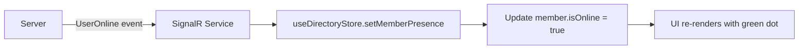

# SignalR Integration Guide

## Overview

This application uses **SignalR** for real-time bidirectional communication between the client and server. After successful login, the app automatically:

1. ✅ Connects to SignalR hub
2. ✅ Fetches online members from `/api/users/online`
3. ✅ Subscribes to real-time presence updates
4. ✅ Displays online/offline status based on `isOnline` field

## Architecture

### Files Structure
```
src/
├── lib/
│   ├── signalr/
│   │   ├── hub.ts          # SignalR connection service
│   │   └── index.ts        # Public exports
│   └── api/
│       └── members.ts      # Members API endpoints
├── stores/
│   ├── useAuthStore.ts     # Auth store (connects SignalR on login)
│   └── useDirectoryStore.ts # Members store (manages online users)
└── types/
    └── index.ts            # Members interface
```

## Login Flow

### Step-by-Step Process

When a user logs in successfully:

```typescript
// 1. Generate authentication token
const tokens = await authApi.generateToken(username);
// Response: { accessToken, refreshToken, expiredAt }

// 2. Connect to SignalR hub
await signalRService.connect();
// Connects to: https://localhost:7123/chatHub
// Token automatically attached via accessTokenFactory

// 3. Fetch online members list
await useDirectoryStore.getState().loadMembers();
// Calls: GET /api/users/online
// Response: Members[]

// 4. Subscribe to presence updates
useDirectoryStore.getState().subscribeToPresence();
// Listens to: UserOnline, UserOffline, PresenceUpdate events
```

### Login Success Toast Flow
- ✅ "Welcome back, {username}!"
- ✅ "Connected to chat server"
- ⚠️ "Connected but real-time features may be limited" (if SignalR fails)

## Members Interface

```typescript
export interface Members {
  id: string;
  fullName: string;
  username: string;
  email: string;
  isOnline: boolean;           // ← Used for online/offline status
  displayName: string;
  applicationCode: string;
  applicationUserCode: string;
}
```

## API Endpoints

### Get Online Members
```typescript
GET /api/users/online

Response: Members[]
[
  {
    "id": "user123",
    "fullName": "John Doe",
    "username": "johndoe",
    "email": "john@example.com",
    "isOnline": true,             // ← Online status
    "displayName": "John",
    "applicationCode": "APP001",
    "applicationUserCode": "USR001"
  }
]
```

### Get All Members
```typescript
GET /api/users

Response: Members[]
```

### Get Member By ID
```typescript
GET /api/users/{userId}

Response: Members
```

## SignalR Hub Connection

### Connection Setup

```typescript
import { signalRService } from '@/lib/signalr';

// Connect to hub (automatic on login)
await signalRService.connect();

// Check connection status
const isConnected = signalRService.isConnected();

// Disconnect (automatic on logout)
await signalRService.disconnect();
```

### Hub URL Configuration

The hub URL is configured in `.env`:

```env
VITE_API_BASE_URL=https://localhost:7123
```

SignalR connects to: `{VITE_API_BASE_URL}/chatHub`

### Automatic Reconnection

SignalR automatically reconnects with exponential backoff:
- **0s**: Immediate retry
- **2s**: After first failure
- **10s**: After second failure
- **30s**: After third failure
- **60s**: Every minute thereafter

## SignalR Events

### Server → Client Events

The client listens to these events:

#### UserOnline
```typescript
signalRService.on('UserOnline', (userId: string) => {
  // User came online
  // Updates member's isOnline to true
  // Shows toast: "{displayName} is now online"
});
```

#### UserOffline
```typescript
signalRService.on('UserOffline', (userId: string) => {
  // User went offline
  // Updates member's isOnline to false
});
```

#### PresenceUpdate
```typescript
signalRService.on('PresenceUpdate', (userId: string, isOnline: boolean) => {
  // General presence update
  // Updates member's isOnline status
});
```

#### ReceiveMessage
```typescript
signalRService.on('ReceiveMessage', (message: Message) => {
  // New message received
});
```

#### TypingIndicator
```typescript
signalRService.on('TypingIndicator', (conversationId: string, userId: string, isTyping: boolean) => {
  // User is typing
});
```

### Client → Server Methods

Send messages to the server:

#### Send Message
```typescript
await signalRService.sendMessageToUser(recipientUserId, message);
await signalRService.sendMessageToConversation(conversationId, message);
```

#### Typing Indicator
```typescript
await signalRService.sendTypingIndicator(conversationId, isTyping);
```

#### Update Presence
```typescript
await signalRService.updatePresence('online' | 'offline' | 'away' | 'busy');
```

#### Join/Leave Conversation
```typescript
await signalRService.joinConversation(conversationId);
await signalRService.leaveConversation(conversationId);
```

## Online Status Display

### MembersPanel Component

```typescript
import { Members } from '../../types';

function MembersPanel({ members }: { members: Members[] }) {
  return (
    <div>
      {members.map((member) => (
        <div key={member.id}>
          <Avatar>{member.displayName[0]}</Avatar>
          
          {/* Display online/offline status */}
          <PresenceDot status={member.isOnline ? 'online' : 'offline'} />
          
          <div>
            <h3>{member.displayName}</h3>
            <p>{member.email}</p>
          </div>
        </div>
      ))}
    </div>
  );
}
```

### PresenceDot Component

```typescript
<PresenceDot status={member.isOnline ? 'online' : 'offline'} />

// Renders:
// - Green dot for online (isOnline = true)
// - Gray dot for offline (isOnline = false)
```

## Usage in Components

### Access Members Store

```typescript
import { useDirectoryStore } from '@/stores/useDirectoryStore';

function MyComponent() {
  const { members, isLoading, loadMembers } = useDirectoryStore();
  
  useEffect(() => {
    loadMembers(); // Fetch members from API
  }, []);
  
  return (
    <div>
      {members.map(member => (
        <div key={member.id}>
          {member.displayName}
          {member.isOnline ? '🟢 Online' : '⚫ Offline'}
        </div>
      ))}
    </div>
  );
}
```

### Manually Invoke Hub Methods

```typescript
import { signalRService } from '@/lib/signalr';

async function sendChatMessage() {
  try {
    await signalRService.invoke('SendMessageToConversation', conversationId, message);
  } catch (error) {
    console.error('Failed to send message:', error);
  }
}
```

### Custom Event Handlers

```typescript
import { signalRService } from '@/lib/signalr';

useEffect(() => {
  // Register custom handler
  const handleCustomEvent = (data: any) => {
    console.log('Custom event:', data);
  };
  
  signalRService.on('CustomEvent', handleCustomEvent);
  
  // Cleanup
  return () => {
    signalRService.off('CustomEvent', handleCustomEvent);
  };
}, []);
```

## Error Handling

### Connection Failures

```typescript
try {
  await signalRService.connect();
} catch (error) {
  // Toast shown: "Failed to connect to chat server"
  console.error('SignalR connection failed:', error);
}
```

### Automatic Error Handling

The SignalR service automatically handles:
- ✅ **Connection lost**: Shows toast "Chat connection lost"
- ✅ **Reconnecting**: Shows toast "Reconnecting to chat server..."
- ✅ **Reconnected**: Shows toast "Reconnected to chat server"
- ✅ **Method invocation errors**: Throws errors for handling

## State Management

### useDirectoryStore

```typescript
interface DirectoryState {
  members: Members[];          // List of all members
  isLoading: boolean;          // Loading state
  error: string | null;        // Error message
}

interface DirectoryActions {
  loadMembers();               // Fetch from /api/users/online
  setMemberPresence();         // Update specific member's isOnline
  subscribeToPresence();       // Subscribe to SignalR events
  updateMembersList();         // Replace entire members list
}
```

### Presence Update Flow



## Authentication with SignalR

### Token Attachment

SignalR automatically attaches the access token to the connection:

```typescript
.withUrl(HUB_URL, {
  accessTokenFactory: () => apiClient.getToken(),
  // Token from localStorage is automatically sent
})
```

### Token Expiration

If the token expires:
1. SignalR connection receives 401 Unauthorized
2. API interceptor catches it
3. User redirected to `/login`
4. SignalR connection closed

## Logout Flow

When user logs out:

```typescript
// 1. Disconnect from SignalR
await signalRService.disconnect();

// 2. Clear auth tokens
await authApi.logout();

// 3. Clear members list
useDirectoryStore.getState().updateMembersList([]);

// 4. Show toast
Toast.info('You have been logged out successfully');
```

## Testing

### Check SignalR Connection

Open browser console:

```javascript
// Check if connected
console.log(signalRService.isConnected());

// Get connection
const connection = signalRService.getConnection();
console.log(connection?.state); // Connected, Disconnected, etc.

// Manually send message
await signalRService.invoke('SendMessage', 'Hello');
```

### Simulate Presence Change

From server or SignalR hub, emit:

```csharp
// C# Server-side code
await Clients.All.SendAsync("UserOnline", userId);
await Clients.All.SendAsync("UserOffline", userId);
await Clients.All.SendAsync("PresenceUpdate", userId, isOnline);
```

## Troubleshooting

### SignalR Not Connecting

1. ✅ Check `.env` has correct `VITE_API_BASE_URL`
2. ✅ Verify backend hub is running at `/chatHub`
3. ✅ Check access token is valid
4. ✅ Open Network tab → Filter "websocket" or "sse"
5. ✅ Check CORS settings on backend

### Members Not Loading

1. ✅ Check API endpoint: `GET /api/users/online`
2. ✅ Verify access token is attached (check Network tab)
3. ✅ Check response format matches `Members[]` interface
4. ✅ Check browser console for errors

### Presence Not Updating

1. ✅ Verify SignalR is connected
2. ✅ Check event names match server (case-sensitive)
3. ✅ Verify `subscribeToPresence()` is called after login
4. ✅ Check browser console for SignalR events

### Token Issues

```typescript
// Check token
console.log(apiClient.getToken());

// Check if expired
console.log(apiClient.isTokenExpired());

// Manually refresh (if your API supports it)
await authApi.refreshToken();
```

## Best Practices

### ✅ DO

- Let SignalR connect automatically on login
- Use `isOnline` field from Members interface for status display
- Subscribe to presence events in `useDirectoryStore`
- Handle connection errors gracefully
- Show user-friendly toast messages

### ❌ DON'T

- Don't connect SignalR before authentication
- Don't manually manage connection state (automatic reconnect)
- Don't show toasts for every presence change (too noisy)
- Don't block login if SignalR fails
- Don't forget to disconnect on logout

## Summary

✅ **SignalR installed**: `@microsoft/signalr`  
✅ **Hub service created**: `src/lib/signalr/hub.ts`  
✅ **Members API created**: `src/lib/api/members.ts`  
✅ **Members interface**: Uses `isOnline` for status  
✅ **Auto-connect on login**: After token generation  
✅ **Auto-fetch members**: Calls `/api/users/online`  
✅ **Real-time updates**: Via SignalR presence events  
✅ **Online status display**: Green/gray dots in UI  
✅ **Error handling**: Toast notifications  
✅ **Auto-disconnect on logout**: Cleanup handled  

The system is fully integrated and ready to use!
